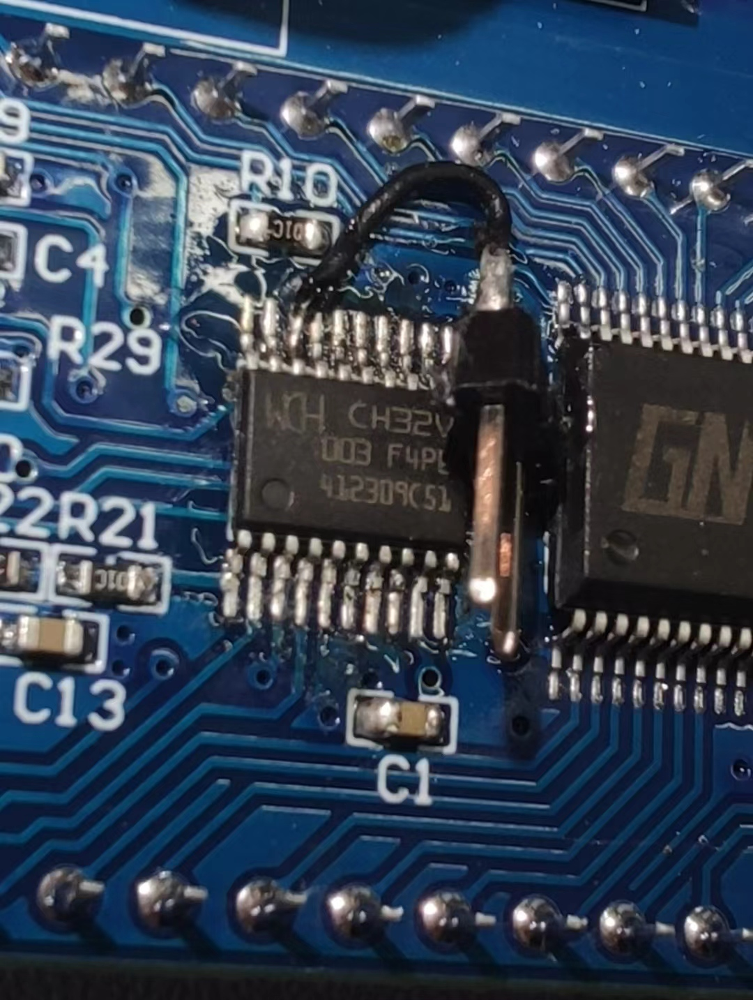
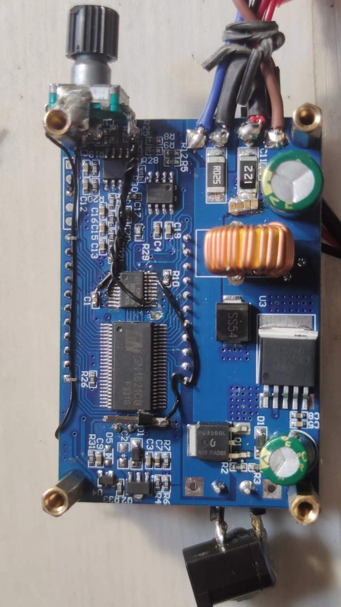

# Hack ZK-J5X V3 with Rust and ch32v003

# Build
* install rust nightly toolchain
* cargo +nightly build --release

# Function: (long press ON/OFF to switch)
* Adjustable power mode
* Lithium battery charger mode, up to 5 cell (determined by input voltage)
* Expand：Rotary encoder

# Thanks to [ch32-rs team](https://github.com/ch32-rs/ch32v00x-hal).

# ZK-J5X

