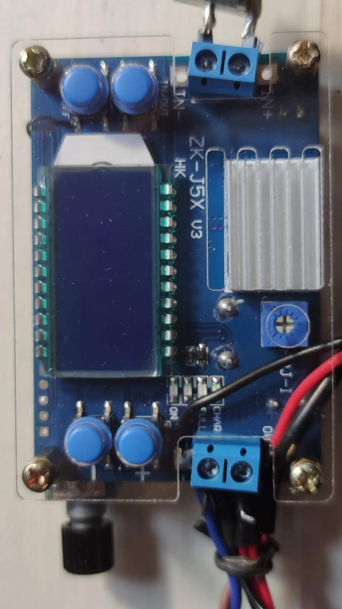
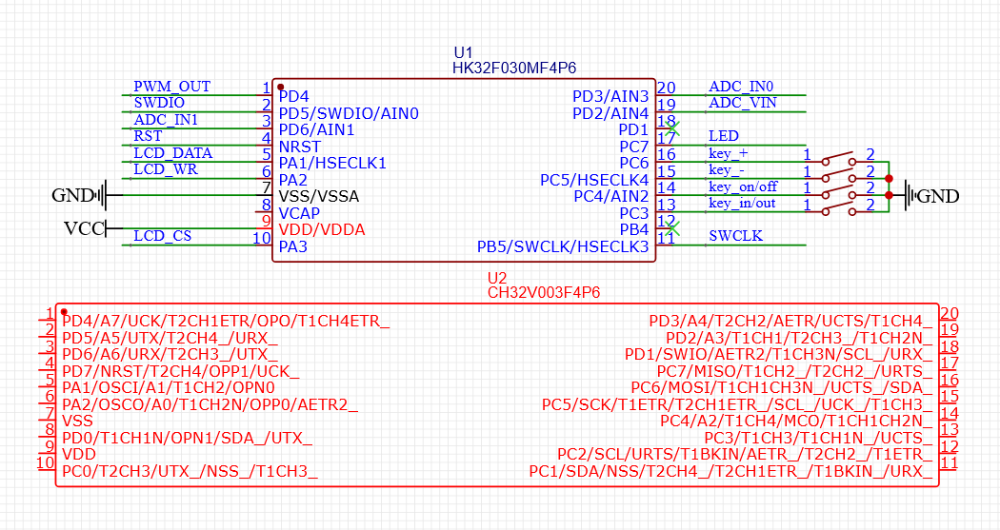

# ch32v003-ZK-J5X-CFW
Hack ZK-J5X V3 with Rust and ch32v003

# Build
* Need build custom compiler. [follow this guide](https://github.com/ch32-rs/ch32v00x-hal/tree/b774e457b07077b7c0a6f52524a5892144065272#guide-on-rust-with-riscv32ec)

# ZK-J5X

